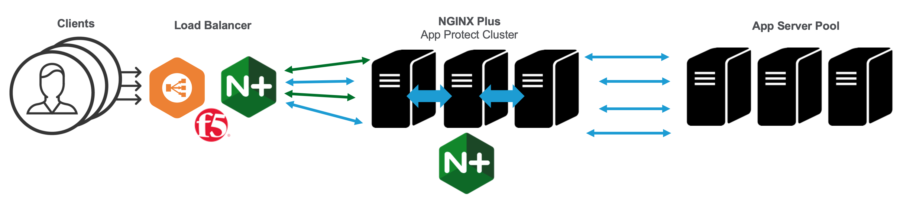
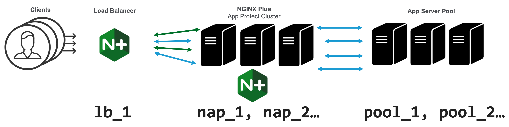

# NGINX Plus Cluster for NAP
[YouTube recording of this demo](https://youtu.be/7C9v0LQAPs0)

This demo leverages the scaling capability of *Docker Compose* to show how the [Zone Synchronization](https://docs.nginx.com/nginx/admin-guide/high-availability/zone_sync_details/) feature of *NGINX Plus* allows nodes to form a cluster and share runtime state information in realtime.

Zone Synchronization allows three types of state data to be kept in sync within a cluster:
1. Session Persistence
2. Rate Limits
3. Key-Value Stores

In this demo, we will sync three rate limits and one key-value across the cluster.

## Demo Use Case

As shown in the above diagram, NGINX App Protect WAF is protecting a pool of application servers. There is a load balancer in front spraying traffic across the WAF nodes.

NGINX App Protect is enforcing three security policies (and rate limits): *strict, medium, and default*.

We choose the policy (and rate limit) to use based on the "user agent" of the client.  Clients using Chrome are assigned the "strict" policy, Safari clients get the "medium" policy, and everyone else ends up with "default."

We can override the security policy chosen by using an IP address lookup table stored as an NGINX Plus key-value store. The key is the IP address or CIDR of the client. The value is the security policy to use regardless of user agent.

Normally, NGINX nodes run standalone from each other. An single NGINX configuration can be cloned multiple times for horizontal scalability without conflicting with one another.

In this scenario, however, we want multiple nodes to behave like a single node.  The key-value store and rate limits must look the same regardless of which NGINX node accepts a connection.

We achieve this by joining the NGINX App Protect nodes into a cluster. If a change is made to the key-value store on one node the change is automatically propogated to all the other nodes so they stay in sync. Request volume is also shared so when a rate limit is reached on one node it automatically is triggered on all nodes of the cluster.
## Demo Environment

We will construct our demo environment as three services deployed by `docker-compose up`:
1. The `lb` service provides the load balancer that sprays traffic across the NGINX cluster
2. The `nap` service provides the NGINX App Protect (NAP) cluster itself
3. The `pool` service provides the application servers

Two Docker images are created: The first, named "**lb**", uses `Dockerfile.lb` to install NGINX Plus into a container to be used as a simple L7 load balancer.  The second, named "**nap**", uses `Dockerfile.nap` to extend the "**lb**" image with additional layers for NGINX App Protect installation and configuration. A simple [hello container from Docker Hub](https://hub.docker.com/r/nginxdemos/hello) is used for the "**pool**" app server tier.

When launched, Docker Compose will start one `lb`, two `nap`, and two `pool` containers. You can increase and decrease the number of `nap` and `pool` nodes using `docker-compose scale`. The number of `lb` nodes must stay at one since ports are mapped to this container.

Three ports are mapped on the Docker host to the "**lb**" container:
1. Connections on port 80 are sprayed round robin across all `nap` nodes
2. Connections on port 82 are proxied directly to `nap_1`

*Edit the `docker-compose.yml` file to change these ports if needed*

The `lb.conf` and `nap.conf` files contain the `nginx.conf` for the **lb** and **nap** containers.  *You can edit these files directly on the Docker host as they are bind mounted into each container.*

The `policies` directory contains security policy and logging config files for NGINX App Protect. *These files can also be edited directly on the Docker host.*
## Demo Walkthrough
1. Clone this repo to your local Docker host.

2. Copy your NGINX Plus `nginx-repo.*` files to the `napCluster` directory where you cloned this repo.

2. Start up the demo using `docker-compose up` *Starting the demo for the first time will also build the "**lb**" and "**nap**" Docker containers.*

3. Each container will display its logs in your terminal prepended with its container name.

4. The **nap_1** and **nap_2** containers will need a minute or two to compile their security policies. Look for "configuration_load_success" to appear in the logs before continuing.

5. Point a web browser to the IP address of the Docker host. Your web browser will display a plain text listing of server name, address, date, URI, and request id.

6. The Docker Compose log output will show three entries for each request: A line from the **lb** container, a line from a **nap** container, and a line from a **pool** container.

```c
pool_1  | 172.19.0.2 - - [29/Aug/2022:17:50:25 +0000] "GET / HTTP/1.0" 200 141 "-" "Mozilla/5.0 (Macintosh; Intel Mac OS X 10_15_7) AppleWebKit/605.1.15 (KHTML, like Gecko) Version/15.5 Safari/605.1.15" "192.168.1.38"
nap_1   | 172.19.0.4 - policy=customer_mediumpolicy,client="192.168.1.38" SECURITY_WAF_OK
lb_1    | 192.168.1.38 - request="GET http://dmz/" 
```

7. Each line starts with the IP address of the inbound connection. Notice how the **lb** container accepted a connection from your web browser, the **nap** container accepted a connection from the **lb** container, and the **pool** container accepted a connection from the **nap** container.

8. The IP address of the web browser is captured in an `x-forwarded-for` header and shared with the **nap** and **pool** containers (as shown in their log entries)

9. The name of the security policy chosen is logged by the **nap** containers. Using a Chrome browser should choose a "strict" policy, Safari or an iPhone should choose a "medium" policy, and any other browser should choose the "default" policy.

10. To use IP address instead of user agent to select the security policy, add the IP address (and preferred security policy) of the client to the key-value store using the NGINX Plus API. A shell script named `addkey.sh` is provided to do this. For example, to change the security policy of a Chrome browser at IP address 10.0.0.1 from strict to medium run the script like this:

```console
$ ./addkey.sh 10.0.0.1 medium
```

11. If you use `curl` to send a request, the **nap** container will choose the "default" policy as expected, but you will also see an additional log line indicating the request was flagged as a potential "bot" client:

```c
pool_2  | 172.19.0.6 - - [29/Aug/2022:17:16:54 +0000] "GET / HTTP/1.0" 200 141 "-" "curl/7.79.1" "192.168.1.38"
nap_2   | status=alerted,violations=Bot Client Detected,signature_ids=N/A,support_id=12851107847352784420
lb_1    | 192.168.1.38 - request="GET http://dmz/" 
nap_2   | 172.19.0.4 - policy=customer_defaultpolicy,client="192.168.1.38" SECURITY_WAF_FLAGGED
```

12. To show how a request can be blocked, append `?<script>` to the URL:

```c
nap_2   | status=blocked,violations=Illegal meta character in parameter name,Attack signature detected,Violation Rating Threat detected,Bot Client Detected,signature_ids=200001475,200000098,support_id=12851107847352785440
nap_2   | 172.19.0.4 - policy=customer_defaultpolicy,client="192.168.1.38" SECURITY_WAF_VIOLATION
lb_1    | 192.168.1.38 - request="GET http://dmz/?<script>" 
```
*Notice how the request does not get proxied to a **pool** container.*

13. To test rate limits, quickly click the refresh button on the browser multiple times until the message "503 Request Temporarily Unavailable" appears. Inspecting the logs will show that the rate limit was hit on both the **nap_1** and **nap_2** nodes.

## NGINX Plus Dashboard
Each **nap** instance has a realtime monitoring dashboard enabled. To access the dashboard, use the following URL: (Replace *docker-host* below with the IP or hostname of your Docker host)

- Dashboard on **nap_1**: http://*docker-host*:82/dashboard.html

After the dashboard appears, click on "HTTP Zones" and notice there are three types of counters:

- Server Zones - The `http_traffic` zone counts all traffic handled by the server. *This number will keep incrementing since the dashboard continuously queries the NGINX API for statistics*
- Location Zones - There is one zone for each security policy's traffic counts.
- Limit Req - Shows the status of each of the three rate limits

Click on "Cluster" to see the status of the cluster. There are four zones being synchronized, the IP address key-value store and the three rate limits.  The record counts will increase on all nodes when more entries are added to the key-value store or more clients connect to the each of rate limits. The "Nodes online" metric shows how many other nodes are in this cluster not including itself.

## Scaling the cluster
You can change the number of nodes in the cluster (or the app server pool) using the following command: 

```console
$ docker-compose scale nap=3
Creating napcluster_nap_3 ... done
```

## Running in AWS Fargate
Docker Compose can also deploy this environment to AWS. To do this you will need the version of the `docker` CLI with "Cloud Integration." (Run the `docker version` command and look for "Cloud Integration" in the output.) The `docker` CLI included with Docker Desktop on Mac and Windows includes this integration. For Linux, follow these instructions to [Install the Docker Compose CLI on Linux](https://docs.docker.com/cloud/aci-integration/#install-the-docker-compose-cli-on-linux).

Next, you will need the AWS CLI installed on your Docker host and configured to access your AWS account. [Click here for instructions](https://docs.aws.amazon.com/cli/latest/userguide/cli-chap-getting-started.html)

Now, follow these instructions to connect Docker to AWS and deploy the demo to AWS Fargate:

1. Create a docker context for AWS and switch to it
```console
$ docker context create ecs aws
$ docker context use aws
```
2. Authenticate to Amazon's *Elastic Container Registry* and create a new private repo
```console
$ aws ecr get-login-password | docker login --username AWS --password-stdin <your ECR>.dkr.ecr.us-east-1.amazonaws.com
$ aws ecr create-repository --repository-name nap
```
3. Build an AWS ready image using the provided Dockerfile and push it to ECR
```console
$ docker build -f Dockerfile.aws -t <your ECR>.dkr.ecr.us-east-1.amazonaws.com/nap:latest .
$ docker push <your ECR>.dkr.ecr.us-east-1.amazonaws.com/nap:latest
```
4. Use the "compose" option to the `docker` CLI (not `docker-compose`) to create the demo in Fargate
```console
$ docker compose --file aws-compose.yml up
```
5. Inspect the containers started in Fargate and use the FQDN provided to access NGINX remotely
```console
$ docker compose ps
```
6. Shutdown the demo when you finish to stop AWS usage charges
```console
$ docker compose down
```